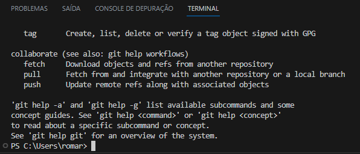
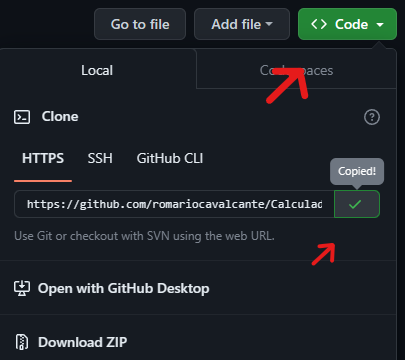
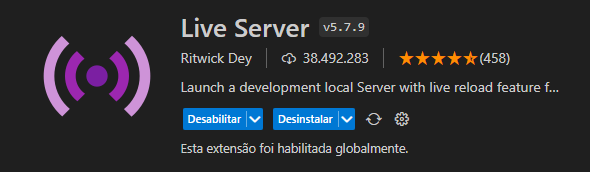

### Desafio da Calculadora 🧮
***
#### Sobre o desafio

* O objetivo do projeto é criar uma calculadora simples, onde será possível realizar as seguintes operações: `soma (+)`, `subtração (-)`, `multiplicação (*)` e `divisão (/)` exibindo o resultado na tela.

* Com foco no código Javascript foi disponibilizado toda a parte 'FrontEnd', faltando somente a lógica do 'BackEnd', que deve ser feita no arquivo `script.js` disponibilizado no código base.

#### Inicialmente 

1. Use o arquivo `script.js` para fazer o desafio.
2. No arquivo `calculadora.html` você precisará adicionar somente um `id="nomedatag"` para indicar a tag que vai receber o código javascript, ou o evento `onclick="nomedafunção()"` para que seja ativada a função desejada. Por exemplo:

> `

` ou  `<button onclick="nomedafunção()">
`

#### Ferramentas

###### VSCode
* Para fazer o código é preciso utilizar um editor de código, entre os mais utilizados atualmente está o VSCode, que indico para fazer o desafio, porém sinta-se a vontade para utilizar qualquer editor de sua preferência. O link para obter o editor está indicado a seguir.
> [https://code.visualstudio.com/Download](https://code.visualstudio.com/Download)

###### Git
* O `Git` é um sistema de controle de versão distribuído gratuito e de código aberto projetado para lidar com tudo, desde pequenos até Projetos muito grandes com rapidez e eficiência. É como uma linguagem de programação que você instala na sua máquina, que vai ser utilizada para comunicar seu computador ao site de versionamento de código `GitHub`. A seguir o link para baixar o Git, baixe e instale-o em sua máquina.

> [https://git-scm.com/](https://git-scm.com/)

###### GitHub
* O `GitHub` é uma plataforma de hospedagem de código-fonte baseada em nuvem que permite que desenvolvedores e equipes trabalhem juntos em projetos de software. Em resumo é um local de hospedagem para o seu código. A seguir o link para visualizar essa plataforma, crie sua conta e acesse para dar uma olhada.

> [https://github.com/](https://github.com/)

#### Baixar e configurar o código no seu computador

1. Com o VSCode/outros e Git instalados na sua máquina, siga os comandos no terminal do editor:

* Inicialmente vamos verificar se o prompt do VSCode reconhece o `Git`, digite o seguinte comando no prompt do editor:

> git

* Na saída deve aparecer algo parecido com a imagem a seguir:

* Significa que está tudo pronto, e você pode clonar o projeto em sua máquina, mas antes `veja como você pode clonar qualquer projeto`. Primeiramente abra o projeto clicando nele, depois `clique no botão verde` em seguida clique em copiar como representado na imagem a seguir.

* Com o link do projeto copiado, agora você deve cloná-lo em sua máquina, com o seguinte comando no prompt do seu editor:

> git clone https://github.com/romariocavalcante/Calculadora.git

* A parte git clone é padrão e se repete em qualquer respositório que vá clonar e é seguida do link do repositório copiado.

* Se funcionar deverá aparecer todos os arquivos copiados na sua máquina, daí é só partir pro código. 😉

###### Rodando o código na sua máquina

* Por se tratar de `código base para FrontEnd` você deve precisar de um `servidor HTTP` para reconhecer no seu navegador. O VSCode tem uma vasta biblioteca de extensões prontas para fazer isso bastando apenas instalar. Para rodar esse projeto eu indico que use a extensão `Live Server`.

###### Com instalar o Live Server

* Vá na aba lateral do VSCode e procure extensões, pesquise Live Server e clique em instalar. A imagem abaixo mostra qual é a extensão, ah lembre-se de reiniciar o VSCode para reconhecer a extensão.

* Assim que reiniciar o VSCode deve aparecer a opção `Go Live` na barra inferior lado direito do editor, ao clicar deve abrir a janela do seu navegador padrão com alguns arquivos, clique no arquivo `calculadora.html` ou abra uma aba com o arquivo `calculadora.html` no editor que vai abrir diretamente.

##### 🥰 Seu chegou até aqui significa que seguiu esse tutorial e deu tudo certo 👏🏻

##### Aproveite, conhecimento nunk é demais!!!!

#### PS caso você tenha encontrado problemas com esse tutorial entre em contato através do email [romariocavalcant@gmail.com](romariocavalcant@gmail.com) e tire suas dúvidas!